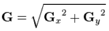
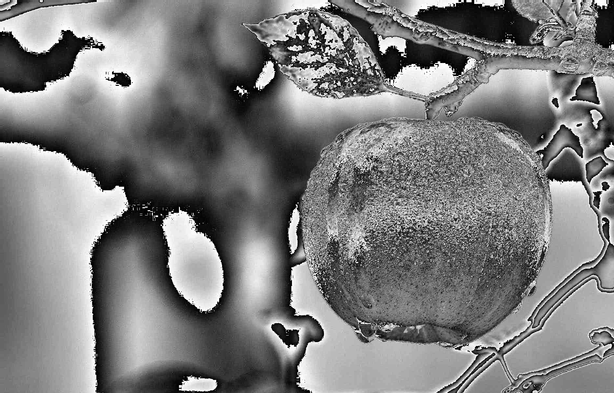

Computer Vision - Edge Detection - Seam Carving
===============================================

### Introduction
This project is created for implementing _**Edge Detection**_ and _**Seam Carving**_ without libraries.

### Description
In the following, details of the parts are described. Implementations are done by using only _"numpy"_. Therefore, processes take some time especially for seam carving.

#### part1
At this part, _**Sobel Operator**_ and _**LoG**_ filters are implemented to detect edges.

##### Sobel Operator
There are two filters to find vertical and horizontal gradients.

Gx is applied to get horizontal gradient and Gy is applied to get vertical gradient. To get final gradient, the following formula is applied for each pixel.

In the following, result of the _"Sobel Operator"_ is shown.

Original Image         |  Sobel Operator
---------------------- | ----------------------
 | 

 

##### LoG 
Before applying Laplacian filter, Gaussian filter is applied to reduce noise. Therefore, it is named _"Laplacian of Gaussian"_ (LoG) filter. This filter can be calculated with the following formula:

In the following, results of the _**LoG**_ is shown with different _σ_ values.

Original Image         | LoG (σ = 0.25)         | LoG (σ = 0.50)         | LoG (σ = 0.75)
---------------------- | ---------------------- | ---------------------- | ----------------------
 |  |  | 

#### part2
At this part, _**Seam Carving**_ is implemented. For seam carving, the following steps are done:

1) Image is converted to a numpy matrix.
2) Magnitude of Gradient is found for the matrix with filters such as _Sobel Operator_ or _LoG_.
3) Energy matrix is calculated for the matrix.
4) Seam is carved according to energy matrix.

More details can be found if it is searched in the Google. The part consists of 2 parts.

_**Part 2.1:**_ It is to show two carves: one is horizontal and one is vertical. In the program, user is able to chose the following preferences:

* _**Picture:**_ _"Istanbul.jpg"_, _"KizKulesi.jpg"_ or _"Lake.jpg"_
* _**Filter type:**_ _Sobel Operator_ or _LoG_ filter
* _**Importance:**_ _Least_ or _Most_ important seam

At below, results of the _"Lake.jpg"_ are displayed with different filter types and different importance.

Original Image         |
---------------------- |
 |

Filter: _Sobel Operator_ Importance: _Least_ |
----------------------------------------------- |
                         |

Filter: _Sobel Operator_ Importance: _Most_ |
---------------------------------------------- |
                        |

Filter: _LoG_ Importance: _Least_ |
------------------------------------ |
              |

Filter: _LoG_ Importance: _Most_ |
----------------------------------- |
             |

_**Part 2.2:**_ It is for decreasing or increasing height or width of the image by seam carving at every iteration. In the program, user is able to chose the following preferences:

* _**Picture:**_ _"Istanbul.jpg"_, _"KizKulesi.jpg"_ or _"Lake.jpg"_
* _**Action:**_ _Decrease Width_, _Decrease Height_, _Increase Width_ or _Increase Width_
* _**Filter type:**_ _Sobel Operator_ or _LoG_ filter
* _**Importance:**_ _Least_ or _Most_ important seam
* _**Number:**_ Number of pixels to carry out the _"Action"_

At below, some results are displayed with different actions, filter types and different importance.

Original Image         |
---------------------- |
 |

Action: _Decrease Width_ Filter: _Sobel Operator_ Importance: _Least_ Number of Pixels: _150_ |
------------------------------------------------------------------------------------------------------ |
                                                                                |

Original Image          |
----------------------- |
 |

Action: _Increase Height_ Filter: _Sobel Operator_ Importance: _Most_ Number of Pixels: _150_ |
------------------------------------------------------------------------------------------------------ |
                                                                                |

### License
Copyright 2019 Burak Kuyucu

Licensed under the Apache License, Version 2.0 (the "License");
you may not use this file except in compliance with the License.
You may obtain a copy of the License at

http://www.apache.org/licenses/LICENSE-2.0

Unless required by applicable law or agreed to in writing, software
distributed under the License is distributed on an "AS IS" BASIS,
WITHOUT WARRANTIES OR CONDITIONS OF ANY KIND, either express or implied.
See the License for the specific language governing permissions and
limitations under the License.

